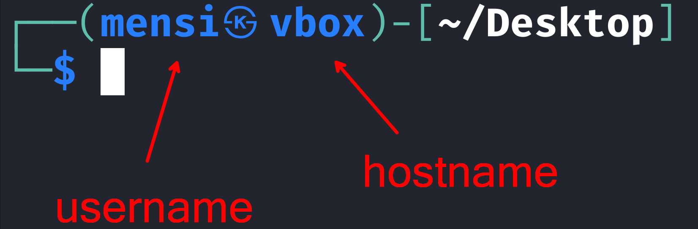
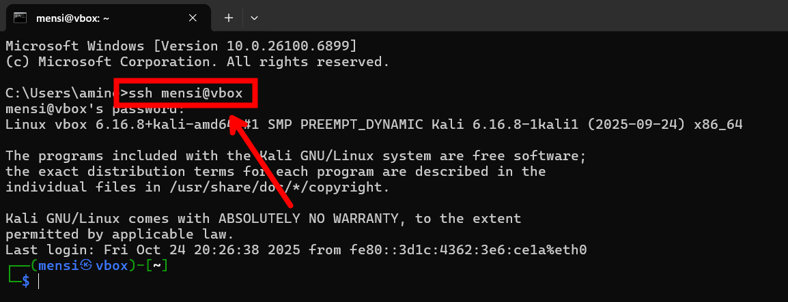
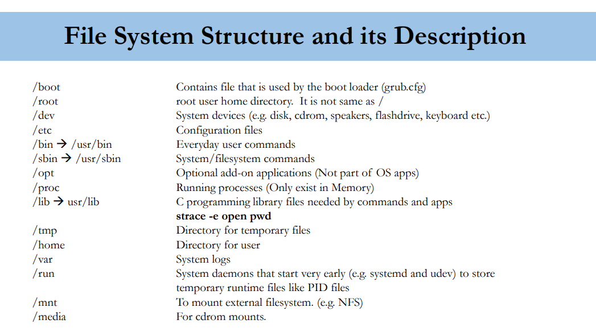

<link rel="stylesheet" href="https://cdnjs.cloudflare.com/ajax/libs/highlight.js/11.8.0/styles/monokai-sublime.min.css">

<link rel="icon" href="./favicon.ico" type="image/x-icon">

# Linux Training

#### + other things you should know

---

## Module 1

## Intrduction to linux

---

## Module 2

## Download, install and configure linux

---

## Module 3

## System access and file system

--

### Step 1 Access the System

There are two access types: **Console** (local) and **Remote**.

Demo (on your local machine):

```bash
whoami
hostname
```

If you have two systems:

```bash
ssh username@192.168.1.x
```

SSH gives you command-line access.

--

### Step 2 Understand the Prompt

- A hostname is the name of a computer or device on a network.



--

### Connect to my VM from Windows using ssh



--

### Step 3 Exploring the File System Structure

```bash
ls /
tree -L 1 /
```

_(install tree if missing: `sudo apt install tree`)_

```bash
┌──(mensi㉿vbox)-[/]
└─$ tree -L 1 /
/
├── bin -> usr/bin

```

This means that /bin is a symbolic link (=soft link) that points to /usr/bin. In other words, when you access /bin, the system redirects you to /usr/bin.

--



--

### Step 4 Navigation

```bash
pwd
cd /
ls
cd /var/log
pwd
cd ~
ls
pwd
```

Explain:

- `cd` → change directory
- `pwd` → print working directory
- `ls` → list files
- TAB key for auto-complete

--

### Step 5 File and Directory Properties

```bash
ls -l /etc | head
```

Explain:

- `drwxr-xr-x` → directory with permissions
- `-rw-r--r--` → regular file
- 2nd column → number of links (soft + hard)
- Owner and group info
- Check slides for all columns

--

### Step 6 Root Meaning

```bash
sudo su
whoami
cd /
pwd
cd ~
pwd
```

Explain 3 meanings:

1. **root account** → superuser
2. **root directory** `/` → top of filesystem
3. **root home** → `/root`

--

### Step 7 File System Paths

### Absolute Path (Starts with /)

```bash
cd /var/log
pwd
```

### Relative Path (Doesn't starts with /)

```bash
cd ..
cd log
```

--

### Step 8 Creating Files and Directories

```bash
mkdir ~/demo
cd ~/demo
touch test1.txt
vim test2.txt
```

Explain:

- `touch` creates empty file
- `vim` opens text editor

--

### Step 9 Copying and Moving

```bash
cp test1.txt copy.txt
mkdir backup
cp -R ~/demo ~/backup_demo
```

- When you use cp -R, it tells the cp (copy) command to copy directories and their entire contents, including all subdirectories and files, recursively.

--

### Step 10 Finding Files

- find command syntax :

```bash
find [starting_directory] [options] [expression]
```

- Example :

```bash
find /etc -name "hosts"
```

--

### Step 11 Wildcards

```bash
cd ~/demo
ls *.txt
ls test?.txt
```

Explain:

- `*` = any string
- `?` = one character
- `[a-z]` = range

--

### Step 12 Hard and Soft Links

```bash
echo "Linux Demo" > fileA.txt
ln fileA.txt hardlinkA
ln -s fileA.txt softlinkA
ls -l
```

Explain:

- Hard link shares same inode (real copy) (same size + same inode)
- Soft link (symbolic) points to the original file (like raccourcie in windows)
